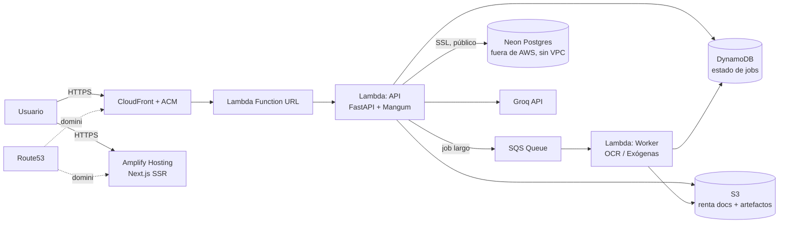

# Case Study: Migrando TaxOps a AWS sin quemar presupuesto

> **Estado: borrador pre-ejecución.** Este documento se escribió durante la fase de discovery/plan, antes de implementar. La sección "Resultados" se completa después del cutover (Chunk 8 del plan de implementación) con métricas reales de costo y estabilidad — no se rellena con números inventados.

## El problema

TaxOps es una plataforma SaaS de automatización contable para empresas colombianas (facturas DIAN, nómina CST 2026, calendario tributario, exógenas Formato 1003, asistente contable con IA). Hoy corre como piloto interno (~50 usuarios/día, horario laboral) sobre:

- **API**: FastAPI en Cloud Run (GCP), scale-to-zero, `--max-instances 1`.
- **Frontend**: Next.js 15 en Vercel.
- **Base de datos**: PostgreSQL serverless en Neon.
- **Storage**: Google Cloud Storage.
- **IA**: Groq API.

Costo actual: **< $1/mes** — pero repartido entre tres proveedores distintos (GCP, Vercel, Neon), sin Infraestructura como Código, y con un bug de arquitectura real: los background jobs (procesamiento de exógenas y OCR de renta) guardan su estado en un diccionario en memoria del proceso y sus artefactos en `/tmp`. Si el contenedor se reinicia, el usuario pierde el job. Eso ya duele hoy, y sería un bloqueo duro para escalar a más de una instancia.

## Por qué migrar

No es un problema de costo (GCP ya es casi gratis) — es un problema de **control, consolidación y foundations para crecer**. El objetivo: mover todo a un solo proveedor (AWS), con Terraform desde el día uno, aprovechando la capa gratuita mientras el producto valida tracción, y con una arquitectura que no haya que rediseñar cuando llegue tráfico real.

## Decisiones de arquitectura (y por qué)

### 1. Lambda, no Fargate/App Runner, para el compute

Cloud Run ya es "serverless containers" — el análogo directo en AWS sería App Runner. Pero App Runner **no tiene capa gratuita**: cobra desde la primera hora. Lambda sí — y no solo 12 meses: **1M requests + 400,000 GB-segundos gratis para siempre**, no solo en el año 1. Con ~50 usuarios/día el tráfico ni se acerca a ese límite. La imagen de contenedor existente (con Tesseract OCR, WeasyPrint, Cairo) corre en Lambda sin cambios de dependencias — Lambda soporta imágenes de hasta 10GB.

### 2. La base de datos se queda en Neon — no se migra a RDS

Esta fue la decisión menos obvia y la que más presupuesto protege. Mover Postgres a RDS/Aurora dentro de AWS obliga a que Lambda pueda hablarle a una IP privada — lo que significa meter Lambda en una VPC. Y una Lambda en VPC que también necesita salir a internet (para llamar a Groq y a Google OAuth) necesita un NAT Gateway. Un NAT Gateway cuesta **~$32/mes fijos**, solo por existir, sin importar el tráfico — más que todo el resto de la factura de AWS de este proyecto combinada. La alternativa (exponer RDS públicamente) cambia el perfil de riesgo de seguridad sin necesidad real. Conclusión: **Neon se queda, Lambda vive fuera de VPC**, y ese único trade-off evita la trampa de costo más común en migraciones "serverless" a medias. Se revisita en Fase 2 si el negocio ya factura y el free tier de Neon se queda corto.

### 3. El bug de estado en memoria se arregla, no se replica

En vez de simplemente "levantar lo mismo en Lambda", el estado de jobs pasa de un dict en memoria a **DynamoDB** (capa gratuita: 25GB + 25 WCU/RCU, para siempre) y el disparo de jobs pasa de `ThreadPoolExecutor` a **SQS** (capa gratuita: 1M requests/mes, para siempre) con un Lambda worker dedicado. Efecto colateral positivo: ahora los jobs sí sobreviven a un redeploy, y el sistema queda listo para correr más de una instancia sin coordinación adicional — algo que la arquitectura actual no soporta hoy, en ningún proveedor.

### 4. Secrets Manager no, SSM Parameter Store sí

Detalle pequeño con impacto real: Secrets Manager cobra $0.40 por secreto por mes. Con ~10 variables sensibles (JWT secret, API keys, OAuth), eso son $4/mes solo por guardar strings. SSM Parameter Store `SecureString` estándar hace exactamente lo mismo (cifrado con KMS, versionado, IAM) y es gratis.

### 5. Amplify Hosting, no S3 estático, para el frontend

Next.js 15 usa App Router con middleware de auth (`taxops-web/middleware.ts`) — necesita SSR real, no un export estático. Amplify Hosting soporta SSR de Next.js nativamente y tiene capa gratuita (1000 min de build + 15GB servidos/mes, 12 meses, y sigue siendo barato después).

## Arquitectura objetivo — Fase 1 (Año 1, capa gratuita)

**Costo estimado Año 1: ~$0.50–1.50/mes** (Route53 hosted zone es prácticamente el único costo fijo; todo lo demás cae dentro de capa gratuita perpetua o de 12 meses con el tráfico actual).

## Arquitectura Fase 2 (cuando haya ingresos reales)

No se implementa ahora — queda documentada como ruta de escalamiento:

- Lambda → Fargate/App Runner solo si el costo por invocación supera lo que costaría un contenedor siempre encendido (tráfico sostenido, no picos).
- Neon → Aurora Serverless v2 si el free tier de Neon se queda corto — ahí sí se justifica pagar la VPC/NAT.
- ALB + WAF una vez haya Fargate real delante.
- Reserved Capacity / Savings Plans una vez el tráfico sea predecible.

## Stack técnico

Terraform (AWS provider ~5.0) · Lambda (container images) · SQS · DynamoDB · S3 · CloudFront · Route53 · ACM · Amplify Hosting · SSM Parameter Store · ECR · GitHub Actions (OIDC, sin llaves de larga duración) · FastAPI · Mangum · Next.js 15

## Resultados

*(Pendiente — se completa después del cutover con: costo real Mes 1 vs. estimado, tiempo de migración, incidentes durante el corte, latencia p50/p95 antes/después, y cualquier ajuste que la teoría no anticipó.)*

---

*Documento vivo — ver el plan de implementación completo en `docs/superpowers/plans/2026-08-05-taxops11-aws-migration.md` y el discovery técnico en `docs/MIGRACION-AWS-DISCOVERY.md`.*
