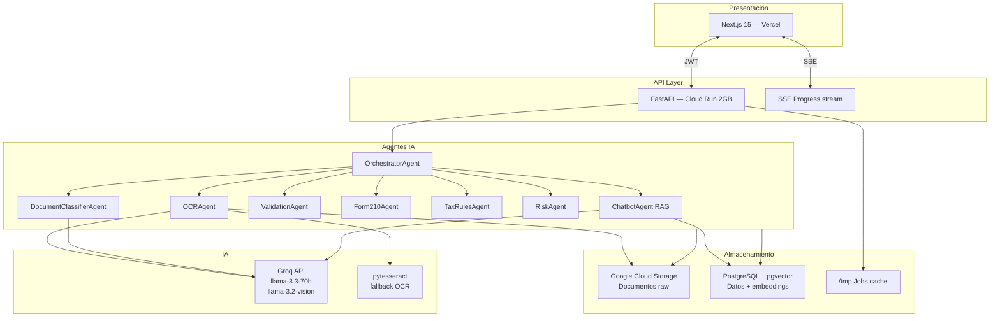
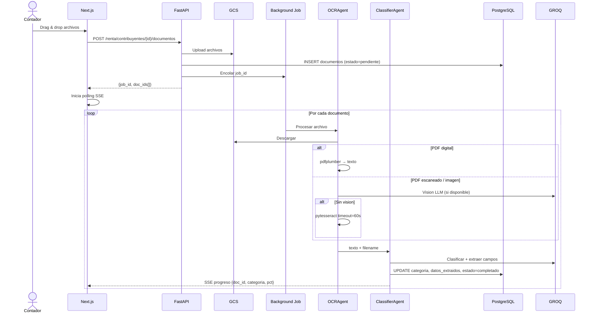
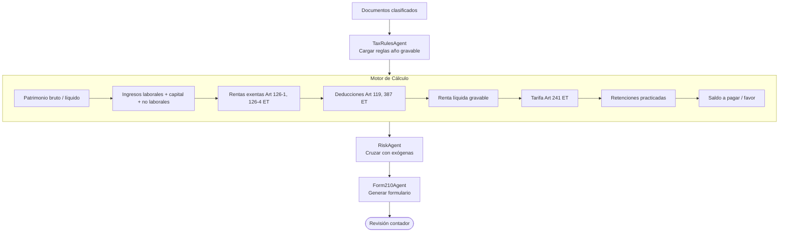

# TaxOps Renta — Arquitectura del Sistema

> Documento de referencia para implementación. Fase 1 MVP.

---

## Stack tecnológico

| Capa | MVP (actual) | Enterprise (Fase 3) |
|------|-------------|-------------------|
| Frontend | Next.js 15 + Vercel | Next.js 15 + CloudFront |
| API | FastAPI + Cloud Run | FastAPI + ECS Fargate |
| DB | Neon PostgreSQL + pgvector | RDS PostgreSQL + pgvector |
| Storage docs | Google Cloud Storage | AWS S3 |
| OCR | pdfplumber + pytesseract + Groq vision | AWS Textract + Bedrock |
| LLM | Groq llama-3.3-70b | Groq + Amazon Bedrock Claude |
| Colas | Cloud Tasks (o in-process) | SQS + EventBridge |
| Vector DB | pgvector (mismo PostgreSQL) | OpenSearch |
| CI/CD | GitHub Actions → Cloud Run | GitHub Actions → ECS |

---

## Arquitectura MVP



---

## Flujo de ingesta documental



---

## Flujo Motor Declaración de Renta



---

## Estructura de carpetas en GCS

```
gs://taxops-docs/
└── {org_id}/
    └── {contribuyente_id}/
        └── {año_gravable}/
            ├── 00_Identificacion/
            ├── 01_Ingresos/
            ├── 02_Bancos/
            ├── 03_Patrimonio/
            ├── 04_Bienes/
            ├── 05_Salud/
            ├── 06_Pensiones/
            ├── 07_Tributario/
            └── 08_Otros/
```

Cada objeto tiene metadata GCS: `{categoria, contribuyente_id, org_id, año_gravable, estado_ocr}`.

---

## Clasificación documental por IA

| Categoría | Carpeta | Documentos típicos | Campos extraídos |
|-----------|---------|-------------------|-----------------|
| `identificacion` | 00 | Cédula, RUT, pasaporte | nombre, doc_num, fecha_exp |
| `ingresos` | 01 | Cert. laboral, honorarios | empleador, salario, año, retención |
| `bancos` | 02 | Extractos, cert. bancarios | banco, saldo_dic, promedio |
| `patrimonio` | 03 | CDT, acciones, fondos | entidad, valor, fecha |
| `bienes` | 04 | Vehículos, escrituras | descripcion, avaluo, año |
| `salud` | 05 | EPS, medicina prepagada | entidad, valor_año |
| `pensiones` | 06 | Colpensiones, fondo privado | entidad, saldo, aportes |
| `tributario` | 07 | RUT, declaraciones ant. | año, renta_gravable, impuesto |
| `otros` | 08 | No clasificados | — |

Threshold mínimo de confianza para clasificación automática: **85%**. Por debajo → carpeta `08_Otros` + alerta.

---

## Diseño de agentes (LangGraph — Fase 2)

Para MVP se implementan como funciones Python directas llamadas desde FastAPI background tasks. En Fase 2 se migran a LangGraph para orquestación con memoria y re-intentos.

```python
# MVP: funciones directas
async def run_ocr_agent(doc_id: str) -> dict: ...
async def run_classifier_agent(doc_id: str, text: str) -> dict: ...
async def run_validation_agent(contribuyente_id: str) -> dict: ...
async def run_form210_agent(contribuyente_id: str, año: int) -> dict: ...
```

---

## Reglas tributarias parametrizables

Las tarifas y límites se almacenan en tabla `reglas_tributarias` y nunca en código. Esto permite actualizar año a año sin deploy.

Ejemplo año 2025:
```json
{
  "año_gravable": 2025,
  "tipo_regla": "tarifa_renta",
  "concepto": "tabla_art241",
  "parametros": {
    "tramos_uvt": [
      {"desde": 0, "hasta": 1090, "tarifa_marginal": 0, "impuesto_base_uvt": 0},
      {"desde": 1090, "hasta": 1700, "tarifa_marginal": 0.19, "impuesto_base_uvt": 0},
      {"desde": 1700, "hasta": 4100, "tarifa_marginal": 0.28, "impuesto_base_uvt": 116},
      {"desde": 4100, "hasta": 8670, "tarifa_marginal": 0.33, "impuesto_base_uvt": 788},
      {"desde": 8670, "hasta": 18970, "tarifa_marginal": 0.35, "impuesto_base_uvt": 2296},
      {"desde": 18970, "hasta": 31000, "tarifa_marginal": 0.37, "impuesto_base_uvt": 5901},
      {"desde": 31000, "hasta": null, "tarifa_marginal": 0.39, "impuesto_base_uvt": 10352}
    ],
    "uvt_2025": 49799
  },
  "fuente_legal": "Art 241 ET modificado Ley 2277/2022"
}
```
