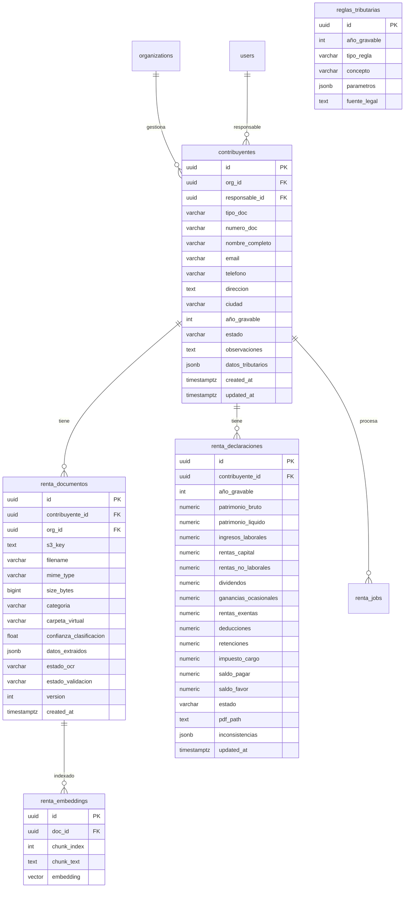

# TaxOps Renta — Modelo de Datos

> Migraciones SQL listas para ejecutar. Agregar a `db/init.sql` o como migración Alembic.

---

## Diagrama ER



---

## SQL de migración

```sql
-- ─── Extensiones ─────────────────────────────────────────────────────────────
CREATE EXTENSION IF NOT EXISTS "pgcrypto";
CREATE EXTENSION IF NOT EXISTS "vector";  -- pgvector para RAG

-- ─── Contribuyentes (personas naturales declarantes) ─────────────────────────
CREATE TABLE contribuyentes (
    id               UUID PRIMARY KEY DEFAULT gen_random_uuid(),
    org_id           UUID NOT NULL REFERENCES organizations(id) ON DELETE CASCADE,
    responsable_id   UUID REFERENCES users(id) ON DELETE SET NULL,
    tipo_doc         VARCHAR(5)   NOT NULL DEFAULT '13',  -- 13=CC, 22=CE, 41=PA
    numero_doc       VARCHAR(20)  NOT NULL,
    nombre_completo  VARCHAR(200) NOT NULL,
    email            VARCHAR(150),
    telefono         VARCHAR(20),
    direccion        TEXT,
    ciudad           VARCHAR(100),
    año_gravable     INTEGER      NOT NULL,
    estado           VARCHAR(30)  NOT NULL DEFAULT 'pendiente_docs',
    -- estados: pendiente_docs | en_proceso | revision | completado | presentado
    observaciones    TEXT,
    datos_tributarios JSONB       DEFAULT '{}',
    created_at       TIMESTAMPTZ  DEFAULT NOW(),
    updated_at       TIMESTAMPTZ  DEFAULT NOW(),
    CONSTRAINT uq_contribuyente_año UNIQUE (org_id, numero_doc, año_gravable)
);

CREATE INDEX idx_contrib_org ON contribuyentes (org_id);
CREATE INDEX idx_contrib_estado ON contribuyentes (org_id, estado);
CREATE INDEX idx_contrib_responsable ON contribuyentes (responsable_id);

-- ─── Documentos de cada contribuyente ────────────────────────────────────────
CREATE TABLE renta_documentos (
    id                       UUID PRIMARY KEY DEFAULT gen_random_uuid(),
    contribuyente_id         UUID NOT NULL REFERENCES contribuyentes(id) ON DELETE CASCADE,
    org_id                   UUID NOT NULL,
    s3_key                   TEXT NOT NULL,           -- gs://taxops-docs/{org}/{contrib}/{año}/{carpeta}/file
    filename                 VARCHAR(255) NOT NULL,
    mime_type                VARCHAR(100),
    size_bytes               BIGINT,
    categoria                VARCHAR(50)  DEFAULT 'otros',
    -- categorias: identificacion | ingresos | bancos | patrimonio | bienes
    --             salud | pensiones | tributario | otros
    carpeta_virtual          VARCHAR(50)  DEFAULT '08_Otros',
    confianza_clasificacion  FLOAT        DEFAULT 0,  -- 0-1
    datos_extraidos          JSONB        DEFAULT '{}',
    texto_ocr                TEXT,                    -- texto completo extraído (para RAG)
    estado_ocr               VARCHAR(20)  DEFAULT 'pendiente',
    -- estados: pendiente | procesando | completado | error
    estado_validacion        VARCHAR(20)  DEFAULT 'pendiente',
    version                  INTEGER      DEFAULT 1,
    created_at               TIMESTAMPTZ  DEFAULT NOW()
);

CREATE INDEX idx_rdoc_contrib ON renta_documentos (contribuyente_id);
CREATE INDEX idx_rdoc_org_cat ON renta_documentos (org_id, categoria);
CREATE INDEX idx_rdoc_estado ON renta_documentos (estado_ocr);

-- ─── Embeddings para RAG (Chatbot tributario por contribuyente) ───────────────
CREATE TABLE renta_embeddings (
    id          UUID PRIMARY KEY DEFAULT gen_random_uuid(),
    doc_id      UUID NOT NULL REFERENCES renta_documentos(id) ON DELETE CASCADE,
    chunk_index INTEGER     NOT NULL,
    chunk_text  TEXT        NOT NULL,
    embedding   VECTOR(1536),         -- dimensiones Groq / OpenAI text-embedding
    created_at  TIMESTAMPTZ DEFAULT NOW()
);

CREATE INDEX idx_embed_doc ON renta_embeddings (doc_id);
CREATE INDEX idx_embed_vec ON renta_embeddings USING ivfflat (embedding vector_cosine_ops)
    WITH (lists = 100);

-- ─── Declaración (datos tributarios consolidados) ─────────────────────────────
CREATE TABLE renta_declaraciones (
    id                    UUID PRIMARY KEY DEFAULT gen_random_uuid(),
    contribuyente_id      UUID NOT NULL REFERENCES contribuyentes(id) ON DELETE CASCADE,
    año_gravable          INTEGER NOT NULL,
    -- Patrimonio
    patrimonio_bruto      NUMERIC(18,2) DEFAULT 0,
    patrimonio_liquido    NUMERIC(18,2) DEFAULT 0,
    -- Ingresos (cedulas)
    ingresos_laborales    NUMERIC(18,2) DEFAULT 0,
    rentas_capital        NUMERIC(18,2) DEFAULT 0,
    rentas_no_laborales   NUMERIC(18,2) DEFAULT 0,
    dividendos            NUMERIC(18,2) DEFAULT 0,
    ganancias_ocasionales NUMERIC(18,2) DEFAULT 0,
    -- Depuraciones
    rentas_exentas        NUMERIC(18,2) DEFAULT 0,
    deducciones           NUMERIC(18,2) DEFAULT 0,
    -- Resultado
    retenciones           NUMERIC(18,2) DEFAULT 0,
    impuesto_cargo        NUMERIC(18,2) DEFAULT 0,
    saldo_pagar           NUMERIC(18,2) DEFAULT 0,
    saldo_favor           NUMERIC(18,2) DEFAULT 0,
    -- Control
    estado                VARCHAR(20) DEFAULT 'borrador',
    -- estados: borrador | revision | aprobado | presentado
    pdf_path              TEXT,
    inconsistencias       JSONB DEFAULT '[]',
    detalle_calculo       JSONB DEFAULT '{}',  -- paso a paso del motor
    updated_at            TIMESTAMPTZ DEFAULT NOW(),
    CONSTRAINT uq_decl_año UNIQUE (contribuyente_id, año_gravable)
);

-- ─── Reglas tributarias parametrizables por año ───────────────────────────────
CREATE TABLE reglas_tributarias (
    id            UUID PRIMARY KEY DEFAULT gen_random_uuid(),
    año_gravable  INTEGER     NOT NULL,
    tipo_regla    VARCHAR(50) NOT NULL,
    -- tipos: tarifa_renta | renta_exenta | deduccion | uvt | patrimonio
    concepto      VARCHAR(100) NOT NULL,
    parametros    JSONB       NOT NULL,
    fuente_legal  TEXT,
    CONSTRAINT uq_regla UNIQUE (año_gravable, tipo_regla, concepto)
);

-- ─── Jobs de procesamiento asíncrono ─────────────────────────────────────────
CREATE TABLE renta_jobs (
    id               UUID PRIMARY KEY DEFAULT gen_random_uuid(),
    contribuyente_id UUID REFERENCES contribuyentes(id) ON DELETE CASCADE,
    doc_id           UUID REFERENCES renta_documentos(id) ON DELETE CASCADE,
    tipo             VARCHAR(30) NOT NULL,
    -- tipos: ocr | clasificacion | declaracion | form210 | export
    estado           VARCHAR(20) DEFAULT 'pendiente',
    progreso         INTEGER     DEFAULT 0,   -- 0-100
    resultado        JSONB,
    error            TEXT,
    created_at       TIMESTAMPTZ DEFAULT NOW(),
    updated_at       TIMESTAMPTZ DEFAULT NOW()
);

CREATE INDEX idx_rjob_contrib ON renta_jobs (contribuyente_id);
CREATE INDEX idx_rjob_estado ON renta_jobs (estado);

-- ─── Datos semilla: reglas tributarias 2025 ──────────────────────────────────
INSERT INTO reglas_tributarias (año_gravable, tipo_regla, concepto, parametros, fuente_legal)
VALUES
-- UVT 2025
(2025, 'uvt', 'valor_uvt', '{"uvt": 49799}', 'Resolución DIAN 187/2024'),

-- Tabla Art 241 ET en UVT (personas naturales residentes)
(2025, 'tarifa_renta', 'tabla_art241', '{
  "tramos": [
    {"desde_uvt": 0,     "hasta_uvt": 1090,  "tarifa_marginal": 0,    "impuesto_base_uvt": 0},
    {"desde_uvt": 1090,  "hasta_uvt": 1700,  "tarifa_marginal": 0.19, "impuesto_base_uvt": 0},
    {"desde_uvt": 1700,  "hasta_uvt": 4100,  "tarifa_marginal": 0.28, "impuesto_base_uvt": 116},
    {"desde_uvt": 4100,  "hasta_uvt": 8670,  "tarifa_marginal": 0.33, "impuesto_base_uvt": 788},
    {"desde_uvt": 8670,  "hasta_uvt": 18970, "tarifa_marginal": 0.35, "impuesto_base_uvt": 2296},
    {"desde_uvt": 18970, "hasta_uvt": 31000, "tarifa_marginal": 0.37, "impuesto_base_uvt": 5901},
    {"desde_uvt": 31000, "hasta_uvt": null,  "tarifa_marginal": 0.39, "impuesto_base_uvt": 10352}
  ]
}', 'Art 241 ET mod. Ley 2277/2022'),

-- Renta exenta laboral (25% — Art 206 num 10)
(2025, 'renta_exenta', 'laboral_25pct', '{
  "porcentaje": 0.25,
  "limite_mensual_uvt": 240,
  "concepto": "Renta exenta laboral Art 206 num 10 ET"
}', 'Art 206 ET'),

-- Deducción intereses vivienda (Art 119 ET)
(2025, 'deduccion', 'intereses_vivienda', '{
  "limite_uvt": 1200,
  "concepto": "Intereses crédito hipotecario Art 119 ET"
}', 'Art 119 ET'),

-- Deducción dependientes (Art 387 ET)
(2025, 'deduccion', 'dependientes', '{
  "porcentaje": 0.10,
  "limite_mensual_uvt": 32,
  "concepto": "Deducción por dependientes Art 387 ET"
}', 'Art 387 ET');
```

---

## Estados del proceso

```
contribuyente.estado:
  pendiente_docs → en_proceso → revision → completado → presentado

renta_documentos.estado_ocr:
  pendiente → procesando → completado → error

renta_declaraciones.estado:
  borrador → revision → aprobado → presentado
```

---

## Notas de implementación

- `datos_tributarios` en `contribuyentes`: almacena datos de contexto libres (tipo declarante, régimen, etc.)
- `detalle_calculo` en `renta_declaraciones`: guarda el paso a paso del motor para auditoría
- `texto_ocr` en `renta_documentos`: texto completo para alimentar pgvector RAG
- pgvector `lists=100`: ajustar a `sqrt(n_filas)` en producción
- Agregar `updated_at` trigger como el de `invoices` existente
